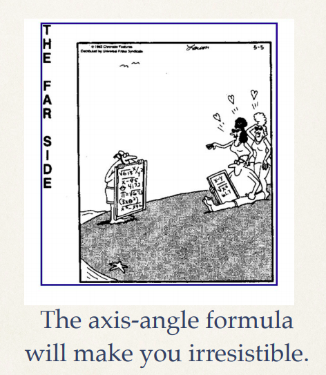

# ESO209-dynamics

Course Repository for ESO209 Dynamics done under Professor Ishan Sharma, Department of Mechanical Engineering. 
Department mandatory course for Mechanical and Aerospace undergrads at IIT Kanpur.
All the course material belongs to Professor Ishan Sharma.

### ESO209 - Your Way to Irresistability
 
### Le Axis Angle Formula
 

## Lectures
### Week 1
L1 - Vectors, CS, Index Notatation 
### Week 2
L2 - Cartesian Vectors 
L3 - Principal Values & Princial Vectors; Symmetric and Skew-Symmetric Tensors; Axial Vector 
### Week 3
L4 - Inverse, Determinant, Orthogonal Tensor, Rotation Tensor 
L5 - Rotation Tensor, Change of coordinates, Rigid Body Kinematics, Euler's Theorem 
### Week 4
L6 - Rigid Body Kinematics: Orientation, Axis-Angle Formula 
L7 - Rigid Body Kinematics: Euler Angle Sequence 
### Week 5
L8 - Rigid Body Kinematics: Rate of change of Orientation in 2D and 3D; Angular Velocity 
L9 - Rigid Body Kinematics: Angular Velocity, Examples, Relation to Euler Angle Sequence 
### Week 6
L10 - Rigid Body Kinematics: Kinematics in a Rotating CS; Velocity Analysis 
L11 - Rigid Body Kinematics: Velocity Analysis Examples; Five-term Acceleration Formula; Applications 
### Week 7
L12 - Rigid Body Kinematics: Acceleration Analysis Examples; Rolling Motion Example 
### Week 8
L13 - Rigid Body Kinetics: Rigid Body Motion; Kinetic Quantities; Moment of Inertia Tensor 
L14 - Rigid Body Kinetics: Inertial CS; Linear Momentum Balance; Angular Momentum Balance 
### Week 9
L15 - Rigid Body Kinetics: Examples; Balance Laws: Power 
L16 - Rigid Body Kinetics: Example of Power Balance 
### Week 10
L16 - Rigid Body Kinetics: Example of Power Balance 
L17 - Rigid Body in Space: Stability; Poinsot Construction; Effect of Energy Dissipation 
### Week 11
L18 - Tops & Gyroscopes 
L19 - More on Tops 
### Week 12
L20 - Collisions: Impulse-Momentum Relations, Elastic and Inelastic Collisions 